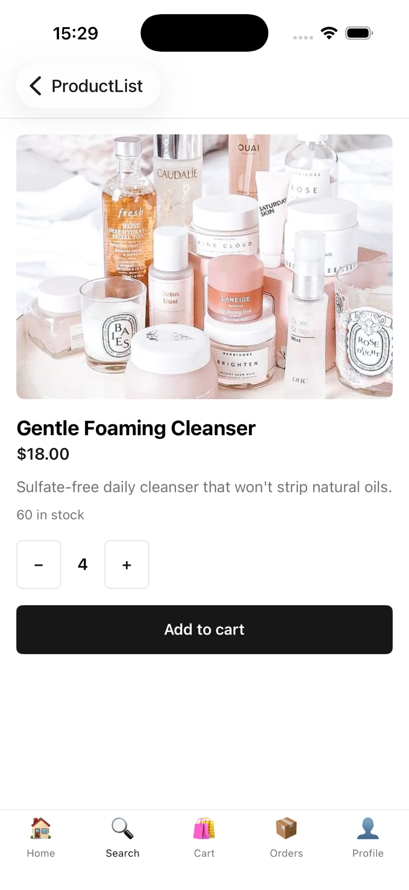
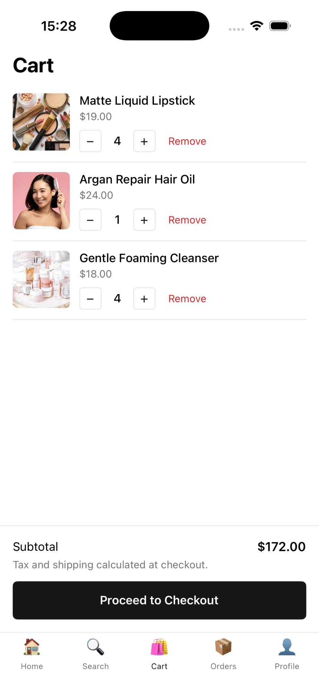
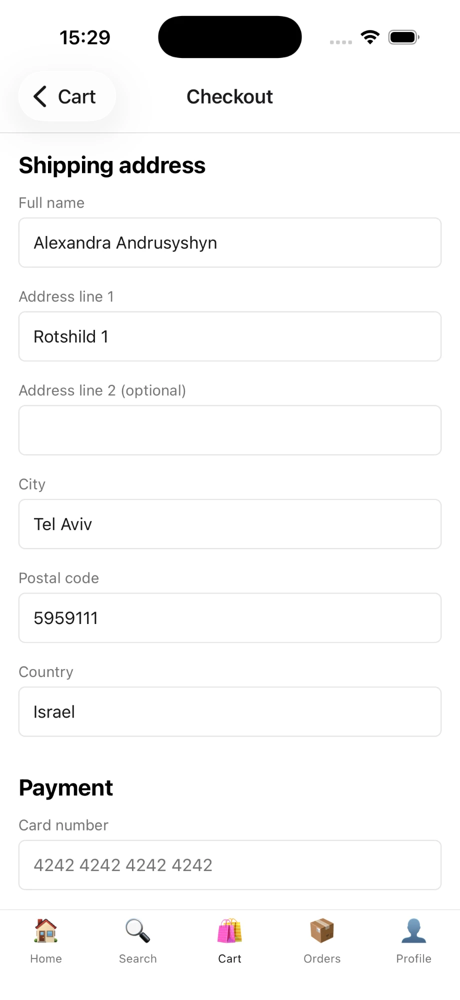
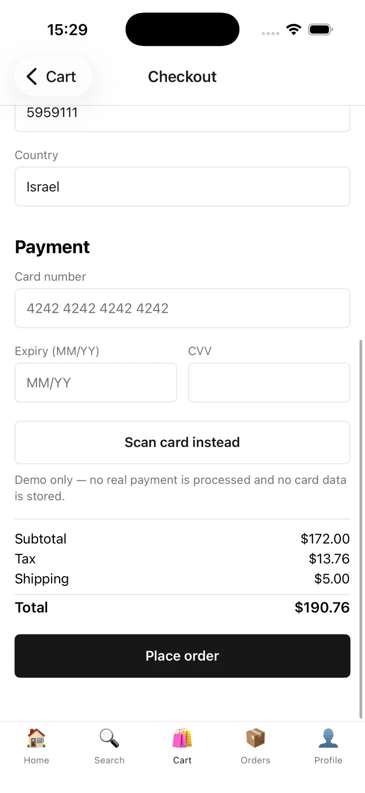
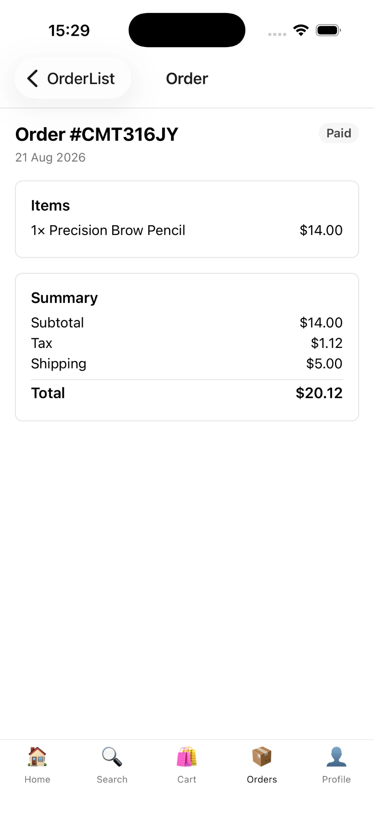

# Bloom Beauty — Cosmetics Store (MVP)

A full-stack cosmetics/beauty e-commerce app built as a portfolio piece: a React Native (Expo) client backed by a Node/Express + PostgreSQL API. The goal wasn't to ship the most screens — it's to demonstrate the judgment calls a senior React Native engineer makes on a real e-commerce checkout flow: correct state-management boundaries, server-authoritative pricing, and a checkout that provably can't double-charge a customer.

> **This is a demo.** No real payment processing happens anywhere in this codebase. See [Credit-card scanning approach](#credit-card-scanning-approach) below.

---

## Screenshots

| Home | Categories | Product |
|---|---|---|
|  |  |  |

| Cart | Checkout — shipping | Checkout — payment |
|---|---|---|
|  |  |  |

| Order details |
|---|
|  |

## Features

- **Browse** — product grid with search (debounced) and category filters, product detail with a quantity stepper.
- **Cart** — add/update/remove items, optimistic UI with rollback on failure, live subtotal.
- **Checkout** — shipping form + card form (client-side Luhn + expiry validation), a mocked "scan your card" camera flow, and **exactly-once order creation** even under a rapid double-tap or a retried network request.
- **Order history** — past orders with their original, immutable snapshot of names/prices (not today's catalog prices).
- **Auth** — register/login, session persisted in secure storage across app restarts.
- Loading, error, empty, and success states are handled explicitly on every data-driven screen — no bare spinners, no silent failures.

## Tech stack

| Layer | Choice | Why |
|---|---|---|
| Mobile | Expo (React Native + TypeScript) | Fast iteration, native camera/secure-storage modules without hand-rolling native code |
| Navigation | React Navigation (native-stack + bottom-tabs) | Per-tab nested stacks so detail/checkout screens push over a tab while keeping the tab bar available on list screens |
| Server state | TanStack React Query | Caching, request de-dupe, cancellation, and optimistic updates — this is what a cart and a checkout flow actually need, not something worth hand-rolling |
| UI/session state | Zustand | Small, no-boilerplate store for the one piece of client-only state that matters: the auth session |
| Forms | React Hook Form + Zod | Uncontrolled-by-default fields (only the changed field re-renders) plus one schema shared between validation and TypeScript types |
| Backend | Node + Express + TypeScript | Small, explicit, no framework magic to explain in an interview |
| Database | PostgreSQL via Prisma | Real relational constraints (a unique index is what actually prevents duplicate orders, not application logic alone) |
| Auth | JWT (bcrypt-hashed passwords) | Enough for a demo; refresh-token rotation is called out below as an accepted MVP shortcut |

**Why React Query *and* Zustand, not just one?** Server data (products, cart, orders) has a source of truth that lives on the server — it needs caching, invalidation, and re-fetching, which is what React Query is for. The auth session is genuinely client-only state with no "re-fetch" concept — Zustand is a better fit and keeps the two kinds of state from being managed by the same mental model.

## Architecture

```
cosmetics-app/
├── ARCHITECTURE_PLAN.md     # original design doc (13 sections, written before any code)
├── BUILD_PLAN.md            # phased execution plan
├── docker-compose.yml       # local Postgres for development
├── backend/                 # Express + Prisma API
└── mobile/                  # Expo React Native client
```

### Backend (`backend/`)

```
src/
├── app.ts, server.ts        # Express app wiring, entrypoint
├── lib/                     # prisma client, error classes, pricing math
├── middleware/               # auth (JWT), request validation, error handling
└── modules/
    ├── auth/                # register, login, me
    ├── products/             # list (search/category/pagination), detail, categories
    ├── cart/                 # CRUD, stock-aware
    └── orders/                # the idempotent create-order flow — see below
prisma/schema.prisma          # User, Product, CartItem, Order, OrderItem
tests/                        # Jest + Supertest
```

Every module follows the same shape: `*.schema.ts` (Zod input validation) → `*.service.ts` (business logic, the only layer that touches Prisma) → `*.controller.ts` (thin HTTP glue) → `*.routes.ts`.

### Mobile (`mobile/`)

```
src/
├── api/                      # one thin wrapper per resource, all routed through client.ts
├── components/               # shared, dumb UI: Button, TextField, Skeleton, EmptyState, ErrorState, Screen...
├── features/
│   ├── auth/                 # screens, RHF+Zod validation, useLogin/useRegister
│   ├── products/              # Home (landing) + Search (browse) screens, product hooks
│   ├── cart/                  # cart screen, optimistic-update hooks
│   ├── checkout/               # shipping/card form, mock card scanner, idempotency guard
│   └── orders/                 # order history + detail
├── navigation/                 # typed param lists, tab/stack wiring
├── state/authStore.ts          # the one Zustand store
└── theme/                      # colors, spacing, typography — every screen reads from here, nothing hardcoded
```

`src/api/client.ts` is the **only** place that calls `fetch`. Every screen goes through a per-resource wrapper (`products.api.ts`, `cart.api.ts`, ...) which goes through this one function — so auth-header injection, timeout handling, and error normalization into a typed `ApiError` all happen in exactly one place, once.

## API overview

All endpoints are JSON over HTTP, versioned implicitly (single version, MVP scope).

| Method | Path | Auth | Notes |
|---|---|---|---|
| POST | `/auth/register` | — | |
| POST | `/auth/login` | — | |
| GET | `/auth/me` | ✓ | |
| GET | `/products` | — | `?search=&category=&page=&limit=` |
| GET | `/products/:id` | — | |
| GET | `/categories` | — | distinct category list |
| GET | `/cart` | ✓ | |
| POST | `/cart/items` | ✓ | upserts by `(userId, productId)` |
| PATCH | `/cart/items/:id` | ✓ | |
| DELETE | `/cart/items/:id` | ✓ | |
| POST | `/orders` | ✓ | requires an `Idempotency-Key` header — see below |
| GET | `/orders` | ✓ | |
| GET | `/orders/:id` | ✓ | |

Errors are always shaped as `{ error: { code, message, details? } }`, mapped client-side to a typed `ApiError` with a `kind` of `network | timeout | validation | unauthorized | not_found | conflict | server`.

## Authentication flow

Register/login return a JWT (7-day expiry) and the user record. The mobile client stores both in `expo-secure-store` via a small Zustand store (`authStore`), which hydrates once at app launch so a returning user skips the login screen entirely. Every authenticated request has its `Authorization: Bearer <token>` header attached automatically inside `api/client.ts` — no screen or hook ever touches a token directly.

A long-lived JWT with no refresh-token rotation is a deliberate MVP shortcut, called out explicitly rather than silently skipped — see [Key technical decisions](#key-technical-decisions).

## Cart/order architecture

The cart is server-side truth, not client state: every mutation (`add`/`update`/`remove`) round-trips to `/cart/items` and the response is the new authoritative cart, which React Query caches under the `["cart"]` key. The mobile hooks (`useAddToCart`, `useUpdateCartItem`, `useRemoveCartItem`) apply an **optimistic update** against that cache on `onMutate` so a tap feels instant, and roll it back on `onError` — the classic React Query optimistic-update pattern, not a hand-rolled one.

An order is **not** "the cart, marked as ordered." When an order is created, every line item's name and price are **copied** into the `OrderItem` row (`nameSnapshot`, `priceSnapshot`) at that moment. If a product's price changes next week, every past order still shows exactly what the customer was charged — order history is a historical record, not a live view of the catalog.

## Checkout flow

This is the part of the app the whole exercise is really about: **the same order must never be created twice**, no matter how a request gets duplicated — a rapid double-tap on "Place order," a network retry after a dropped response, or the user backgrounding and resuming the app mid-request.

The guard has three independent layers, deliberately redundant with each other:

1. **UI layer** — the Place Order button flips to a disabled/loading state *synchronously*, before any async work starts (`isSubmitting` is set in the same tick as the tap handler, not after an awaited call resolves).
2. **Client layer** — one idempotency key (a UUID) is generated once per checkout *attempt* — when `CheckoutScreen` mounts — and reused for every retry within that attempt. A genuinely new attempt (user backs out to Cart and starts over) correctly gets a fresh key on the next mount.
3. **Server layer — the one that actually holds under a race.** `Order.idempotencyKey` has a **unique constraint** in Postgres. `POST /orders` first checks for an existing order with that key and replays it (`200`, not `201`, nothing re-created) if found; otherwise it re-prices the cart from current product prices inside a single transaction, creates the order + snapshotted items, and clears the cart. If two requests with the same key somehow race past the replay check, the database constraint — not application logic — is what prevents a second row.

This is proven, not just asserted: `backend/tests/orders.duplicate.test.ts` submits the same idempotency key twice and asserts exactly one `Order` row exists afterward, the second response reuses the first order's id, and the cart was cleared exactly once.

Pricing is **always** recomputed server-side from the product table at the moment of order creation — the client sends shipping info and a masked card, never a total. `calculateOrderTotals()` (flat 8% tax + $5 flat shipping for MVP simplicity) is the single source of truth; the checkout screen shows the same math client-side purely as a "what you'll likely pay" estimate while the request is in flight.

## Credit-card scanning approach

**This is entirely mocked, and deliberately so** — real payment processing is explicitly out of scope for this MVP (see the architecture doc's MVP-scope section). Two things happen when you tap "Scan card instead":

1. A genuine live camera preview opens (`expo-camera`), with a card-shaped guide overlay — this is real, so the UX reads correctly.
2. After a short delay, the "scan" resolves with a synthetic, Luhn-valid card number and a future expiry date. **No camera frame is ever read or processed.**

This is intentionally isolated behind one interface (`CardScanner.scanCard(): Promise<{ number, expiry }>`, in `mobile/src/features/checkout/lib/cardScanner.ts`). Swapping in a real on-device OCR/card-recognition SDK later is a change to that one function — the screen, the downstream Luhn/expiry validation, and everything else in the checkout flow stay exactly as they are.

Whether typed manually or "scanned," only the **last 4 digits** of the card number are ever sent to the backend (`cardLast4`, typed at the schema level to accept nothing but 4 digits) — the full number, expiry, and CVV never leave the device.

## Key technical decisions

- **Cents everywhere, no floats.** Every price is an integer number of cents, both in the database and across the wire. `formatCents()` is the only place a decimal point gets introduced, at render time.
- **React Query for server state, Zustand for the one piece of client state.** Covered above — this isn't "use both because more libraries," it's that they solve two genuinely different problems.
- **A single `apiRequest()` function.** Every network call in the app funnels through one place, so auth headers, timeouts, and error shapes are guaranteed consistent rather than re-implemented per screen.
- **Idempotency at three layers, not one.** A UI-only guard (disable the button) is the common shortcut and it's not enough — it doesn't survive a killed-and-relaunched app or a genuine network-level retry. The database constraint is what actually can't be circumvented.
- **Long-lived JWT, no refresh rotation.** A real production app would rotate short-lived access tokens against a refresh token; for an MVP demo, a 7-day JWT is a documented trade-off, not an oversight.
- **Skeleton loaders over spinners.** Cheap to build, meaningfully better perceived-performance, and demonstrates attention to a detail that's easy to skip.

## Challenges & solutions

- **iOS's automatic scroll-view inset adjustment created a phantom gap.** The product grid appeared to have a large empty gap above it, but only when the grid was short enough to not fill the screen — the giveaway that it wasn't a padding/margin bug at all. `UIScrollView`'s `contentInsetAdjustmentBehavior` defaults to "automatic" and pads for a safe area on its own, on top of the app's own `SafeAreaView` handling; disabling it (`contentInsetAdjustmentBehavior="never"`) resolved it once the actual mechanism was identified (an earlier attempt to fix it by giving the list `flex: 1` had the opposite effect and made the gap worse, since it gave the scroll view a large empty frame to begin with).
- **Category filter chips changed size when selected.** A `minHeight` (rather than a fixed `height`) on the chip, combined with the parent `ScrollView` row's default cross-axis stretch behavior and the selected chip's bolder font metrics, let the selected chip grow taller than its siblings. Fixed with an explicit `height` and `alignSelf: "flex-start"` so no chip can be stretched by its row.
- **Switching category filters could leave the list scrolled to a stale position.** If you'd scrolled down while viewing a longer list and then switched to a shorter filtered one, the list kept its old scroll offset. Fixed by keying the `FlatList` to the current filter (forcing a clean remount) plus an explicit `scrollToOffset` as a second safety net.

## How to run

**Prerequisites:** Node 18+, Docker (for Postgres), Expo CLI tooling (`npx expo` — no global install needed), Xcode (iOS Simulator) and/or Android Studio (Android Emulator).

### 1. Database

```bash
docker compose up -d
```

### 2. Backend

```bash
cd backend
cp .env.example .env      # fill in DATABASE_URL / JWT_SECRET if you changed the docker-compose defaults
npm install
npx prisma migrate dev
npx prisma db seed
npm run dev                # http://localhost:4000
```

### 3. Mobile

```bash
cd mobile
cp .env.example .env       # EXPO_PUBLIC_API_URL — defaults to http://localhost:4000
npm install
npx expo run:ios           # or: npx expo run:android
```

> Android emulator note: the app automatically rewrites `localhost` → `10.0.2.2` in development, since the emulator can't otherwise reach your machine's `localhost`. A physical device needs your machine's real LAN IP set in `.env`.

**Demo login:** `demo@example.com` / `password123` (seeded by `prisma db seed`), or register a new account.

### Running the tests

```bash
cd backend && npm test     # requires the Postgres container running
cd mobile && npm test
```

The one test worth reading first is `backend/tests/orders.duplicate.test.ts` — it's the proof that the checkout guard described above actually works, not just a description of intent.

# mobile-app-cosmetic-shop
